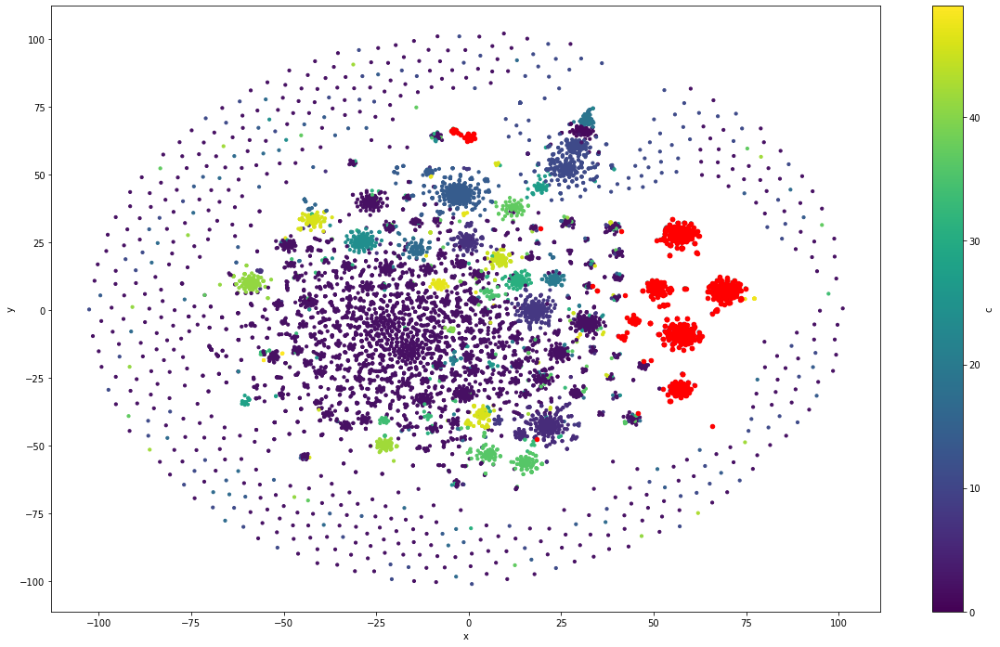
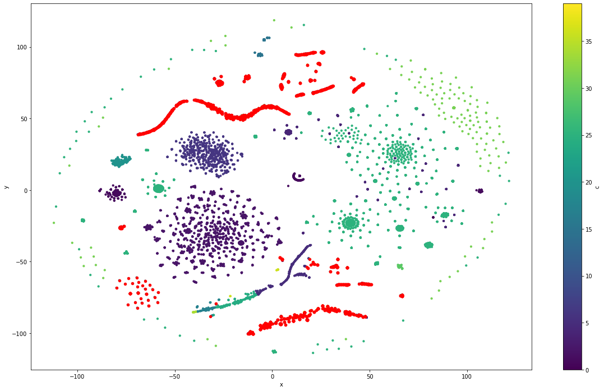

# Toxicity tipification in online game chats
---
 > Subject: Text Mining, FAMAF-UNC, 2021.

 > Teacher: Laura Alonso Allemany

 > Author: César Alvarez Vallero

### Introduction
--- 
In the last 20 years the grow of online gaming has increased the human
communication through online chats inside games. The mix of high
competitiveness and relative anonimity have made a perfect place for the
development of toxicity.

The goal of this work is to detect types of toxicity inside chat conversations
from online games. Some inspiration was taken from the research initiative
founded by Jigsaw and Google (Alphabet subsidiaries) and their kaggle
competitions, were they incentivize the creation of models to detect toxicity
in the comments of wikipedia edtion section. The initial classification
provided by the challenges settled a baseline to classify types of toxicity:

- severe_toxicity
- obscene
- threat
- insult
- identity_attack
- sexual_explicit

Although the current work tries to avoid using this as a framework rather than
a guideline.

### Dataset
--- 
The dataset used is publicly available in
[kaggle](https://www.kaggle.com/romovpa/gosuai-dota-2-game-chats). It contains
chats of almost 1 million matches from public matchmaking of the game Dota2 by
Valve.

To perform the task a subset of the whole dataset was selected. That subset
contained all the english messages inside the dataset. Its total size is around
60 million messages.

Dota2 is an online game that belongs to the genre Multiplayer Online Battle
Arena (MOBA). It involves two teams and an objective that implies the defeat of
the opposite team.

The initial structure of the dataset was the following:

|match|time|slot|text|
|-----|----|----|----|

Where:
- _match_ is the index
- _time_ is the game time when the message was sent
- _slot_ is the player postion in the arena (0–4 for Radiant, 5–9 for Dire)
- _text_ is the message

Some related works using this dataset are:
- [Measuring toxicity in Dota 2](https://www.h4pz.co/dota-2-toxicity)
- [Toxicity detection in gaming](https://databricks.com/notebooks/toxic-test-gam/index.html#01_intro.html)


### Preprocessing
---
As the dataset contained almost a million matches with at least one hundred
messages each one, the size of data became unmanagable rapidly and required
different approachs to overcome that difficulty. Most of the techniques used
involved parallelization.

The task performed over the data can be seen in this
[notebook](./preprocessing.ipynb).

The main points to highlight of this section are:
- Language detection
- Message cleaning: Remove of special characters with regex
- Message filtering: Use of threshold and stop words to select messages
- Feature extraction:
  - Intensity: presence of capital letters and exclamation signs
  - Toxicity: presence of "bad words" obtained from a [web list](https://www.cs.cmu.edu/~biglou/resources/bad-words.txt)


### Approaches
---
The approach for this task was datadriven and it relies heavily in clustering,
with some variations in the generation of the message representation.

The number of english chats in the dataset was around 60 million, so, again, a
subset of 10000 was taken from it, because a bigger sample required more time
that the disposed to achieve results.

The unit selected to clusterize were the messages. Each unit was vectorized
with one of the following techniques:
- Bag of words.
- Word2Vec embeddings.
- FastText embeddings.

Those vectors were concatenated with a vector that represented the number of
ocurrences in a list of [bad words](https://www.cs.cmu.edu/~biglou/resources/bad-words.txt)
and the intensity score for that message.

All vectors were normalized and features with high correlation were removed.

#### Bag of words clustering
--- 
To explore further go to the [notebook](./clustering_bow.ipynb).

The number of clusters choosen for this approach was 50. It was enough to test
the capabilities of the mehtod.

The distribution of chats in clusters was the following:


As you can see, for this clustering approach and this number of clusters, the
cluster 2 reunites all those messages that are unique or couldn't be
differentiated clearly of the rest of them.

Each message was annotated with their cluster, and then the reduced dataset
was grouped by cluster:

```python
bow_group = df_test.groupby('bow_clusters')
```

For each cluster a toxicity score was computed:

```python
bow_score = (bow_group['toxicity'].sum() / bow_group['nwords'].sum())
bow_scored = pd.DataFrame({'score': bow_score.values, 'size': bow_group.size()})
```
Then, they were sorted and filtered to get the cluster with the greatest score:

```python
bow_scored = bow_scored[bow_scored['score'] > 0.14]
bow_scored = bow_scored.sort_values(by=['score', 'size'], ascending=[False, False])
```

<a name="bow-score-table"></a>
The following results were obtained from the previous code:

|bow_clusters|    score   |    size    |
|------------|-----------:|-----------:|
|32.0        |0.545455    |51          |
|10.0        |0.460000    |17          |
|38.0        |0.455285    |45          |
|9.0         |0.451104    |117         |
|22.0        |0.444853    |200         |
|29.0        |0.387013    |123         |
|30.0        |0.379004    |186         |
|5.0         |0.365177    |195         |
|12.0        |0.315789    |4           |
|15.0        |0.250000    |1           |

The content of the most toxic clusters were explored in deep. You can
see some of their content in the following tables. To get the complete content
of the clusters, please, go to the jupyter notebook:

- 1

```python
bow_group.get_group(32)[['match','text']]
```

|   match | text                                                |
|--------:|:----------------------------------------------------|
|     183 | you suck at dota                                    |
|     227 | come suck my dick                                   |
|     972 | can you suck my dick?                               |
|    1383 | Sry clock but u suck :)                             |
|    1395 | suck my big black cock                              |
|    1459 | and u suck as an orgy                               |
|    2201 | suck my balls mirana                                |
|    2459 | you both suck at english                            |
|    2459 | you sure suck your daddy's dick                     |
|    2586 | how long did you suck their dick for to boost you?? |
|    3108 | xDD you suck                                        |
|    3587 | suck my dick as a present for me                    |
|    3587 | i got no gurl to suck it for me                     |
|    4155 | suck my dick riki                                   |
|    4247 | both our teams suck balls                           |
|    4304 | ill watch ur mom suck my dick                       |
|    4397 | who has nice tits and wanna suck my cock?           |
|    4586 | suck your momma's dick BOYYE                        |
|    4769 | you all suck tho xD                                 |
|    4975 | suck my dick you lesser..                           |
|    5202 | ur teamates good...u suck                           |

- 2

```python
bow_group.get_group(10)[['match','text']
```

|   match | text                                                                                                       |
|--------:|:-----------------------------------------------------------------------------------------------------------|
|     183 | you dumb and blind?                                                                                        |
|     183 | its pretty dumb you're complaining, you're literally doing the worst on your team and holding them back LC |
|     290 | my lanes were dumb                                                                                         |
|     537 | that was dumb                                                                                              |
|     539 | real tired of ur dumb ass                                                                                  |
|     741 | cause you guys so dumb cant win mmr                                                                        |
|     839 | sb dumb charge mid too                                                                                     |
|    1381 | talent, ignore this dumb rubick                                                                            |
|    2361 | youre fucking dumb                                                                                         |
|    2361 | you. are. fucking. dumb                                                                                    |
|    2420 | it never was you dumb shit                                                                                 |
|    3276 | can be that dumb                                                                                           |
|    3891 | What a dumb legend player                                                                                  |
|    4189 | the axe pick was dumb... but going 10 death...                                                             |
|    4563 | dumb as you deads ka talaga                                                                                |
|    4902 | are you dumb                                                                                               |
|    4983 | report pudge sp dumb                                                                                       |

- 3

```python
bow_group.get_group(38)[['match','text']
```


|   match | text                                                     |
|--------:|:---------------------------------------------------------|
|     445 | nice mirana idiot                                        |
|     491 | have idiot miranma                                       |
|     554 | fucking idiot offlaner                                   |
|     775 | keep focus idiot                                         |
|    1437 | sorry my friend is an idiot :)                           |
|    1497 | ok u are idiot too                                       |
|    1711 | you speak idiot?                                         |
|    1711 | i cant do anything idiot gay hero                        |
|    1807 | ้he bought sliver edge idiot                              |
|    1807 | idiot your sup                                           |
|    1831 | ez to say when you dont have idiot team mates            |
|    2420 | report this idiot slark                                  |
|    2623 | fucking idiot team                                       |
|    2726 | alright youre just an idiot                              |
|    2875 | pick idiot heros                                         |
|    2965 | idiot want pause he is dead                              |
|    3248 | die like a fking idiot                                   |
|    3527 | this idiot mid unpausing                                 |
|    3527 | he wants ez win coz hes too idiot                        |
|    3660 | this russian idiot jakiro                                |
|    3825 | this fuckign idiot team                                  |
|    4063 | you hatme me idiot                                       |
|    4096 | Idiot sopt pausing                                       |
|    4096 | idiot never learn                                        |
|    4188 | he is the idiot who cant play other role then carry      |
|    4837 | its sd mode are u idiot?                                 |
|    5074 | idiot invoker ever                                       |
|    5074 | injoker no skill idiot                                   |
|    5158 | idiot why go back]                                       |
|    5202 | of course its sniper idiot                               |
|    5375 | Are you some kind of idiot?                              |
|    5396 | you are fucking idiot                                    |

A dimensionality reduction with TSNE was applied to visualize the clusters and
highlight the top toxic clusters of the
[top toxic clusters table](bow-score-table):



##### Results
---

Although the content of the clusters is clearly toxic, its hard to distinguish
subtypes of toxicity in them.
By the nature of this approach and the kind of vectorization applied, you can
recognize that the clustering is too tied to some words, specially those
included in the list of bad words, and that some underlying structures to toxicity
might be hidden or even ignored behind these strong indicators because of their
relevance for the clustering technique applied.

#### Word2Vec clustering
---
To explore further go the the [notebook](./clustering_w2v.ipynb).

#### FastText clustering
---
To explore further go the the [notebook](./clustering_ftt.ipynb).

### Conclusion
