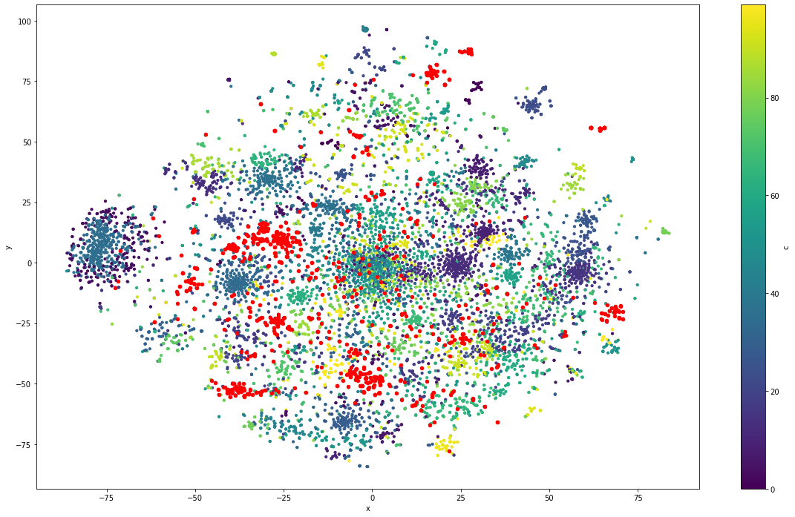

# Toxicity tipification in online game chats
---
 > Subject: Text Mining, FAMAF-UNC, 2021.

 > Teacher: Laura Alonso Allemany

 > Author: César Alvarez Vallero

### Introduction
--- 
In the last 20 years the grow of online gaming has increased the human
communication through online chats inside games. The mix of high
competitiveness and relative anonimity have made a perfect place for the
development of toxicity.

The goal of this work is to detect types of toxicity inside chat conversations
from online games. Some inspiration was taken from the research initiative
founded by Jigsaw and Google (Alphabet subsidiaries) and their kaggle
competitions, were they incentivize the creation of models to detect toxicity
in the comments of wikipedia edtion section. The initial classification
provided by the challenges settled a baseline to classify types of toxicity:

- severe_toxicity
- obscene
- threat
- insult
- identity_attack
- sexual_explicit

Although the current work tries to avoid using this as a framework rather than
a guideline.

### Dataset
--- 
The dataset used is publicly available in
[kaggle](https://www.kaggle.com/romovpa/gosuai-dota-2-game-chats). It contains
chats of almost 1 million matches from public matchmaking of the game Dota2 by
Valve.

To perform the task a subset of the whole dataset was selected. That subset
contained all the english messages inside the dataset. Its total size is around
60 million messages.

Dota2 is an online game that belongs to the genre Multiplayer Online Battle
Arena (MOBA). It involves two teams and an objective that implies the defeat of
the opposite team.

The initial structure of the dataset was the following:

|match|time|slot|text|
|-----|----|----|----|

Where:
- _match_ is the index
- _time_ is the game time when the message was sent
- _slot_ is the player postion in the arena (0–4 for Radiant, 5–9 for Dire)
- _text_ is the message

Some related works using this dataset are:
- [Measuring toxicity in Dota 2](https://www.h4pz.co/dota-2-toxicity)
- [Toxicity detection in gaming](https://databricks.com/notebooks/toxic-test-gam/index.html#01_intro.html)


### Preprocessing
---
As the dataset contained almost a million matches with at least one hundred
messages each one, the size of data became unmanagable rapidly and required
different approachs to overcome that difficulty. Most of the techniques used
involved parallelization.

The task performed over the data can be seen in this
[notebook](./preprocessing.ipynb).

The main points to highlight of this section are:
- Language detection
- Message cleaning: Remove of special characters with regex
- Message filtering: Use of threshold and stop words to select messages
- Feature extraction:
  - Intensity: presence of capital letters and exclamation signs
  - Toxicity: presence of "bad words" obtained from a [web list](https://www.cs.cmu.edu/~biglou/resources/bad-words.txt)


### Approaches
---
The approach for this task was datadriven and it relies heavily in clustering,
with some variations in the generation of the message representation.

The number of english chats in the dataset was around 60 million, so, again, a
subset of 10000 was taken from it, because a bigger sample required more time
that the disposed to achieve results.

The unit selected to clusterize were the messages. Each unit was vectorized
with one of the following techniques:
- Bag of words.
- Word2Vec embeddings.
- FastText embeddings.

Those vectors were concatenated with a vector that represented the number of
ocurrences in a list of [bad words](https://www.cs.cmu.edu/~biglou/resources/bad-words.txt)
and the intensity score for that message.

All vectors were normalized and features with high correlation were removed.

#### Bag of words clustering
--- 
To explore further go to the [notebook](./clustering_bow.ipynb).

The number of clusters choosen for this approach was 50. It was enough to test
the capabilities of the mehtod.

The distribution of chats in clusters was the following:


As you can see, for this clustering approach and this number of clusters, the
cluster 2 reunites all those messages that are unique or couldn't be
differentiated clearly of the rest of them.

Each message was annotated with their cluster, and then the reduced dataset
was grouped by cluster:

```python
bow_group = df_test.groupby('bow_clusters')
```

For each cluster a toxicity score was computed:

```python
bow_score = (bow_group['toxicity'].sum() / bow_group['nwords'].sum())
bow_scored = pd.DataFrame({'score': bow_score.values, 'size': bow_group.size()})
```

Then, they were sorted and filtered to get the cluster with the greatest score:

```python
bow_scored = bow_scored[bow_scored['score'] > 0.14]
bow_scored = bow_scored.sort_values(by=['score', 'size'], ascending=[False, False])
```

With the following results:

|bow_clusters|    score   |    size    |
|------------|------------|------------|
|32.0        |0.545455    |51          |
|10.0        |0.460000    |17          |
|38.0        |0.455285    |45          |
|9.0         |0.451104    |117         |
|22.0        |0.444853    |200         |
|29.0        |0.387013    |123         |
|30.0        |0.379004    |186         |
|5.0         |0.365177    |195         |
|12.0        |0.315789    |4           |
|15.0        |0.250000    |1           |


A dimensionality reduction with TSNE was applied to visualize the clusters and
highlight the top toxic clusters of the previous table:


##### Results
---

#### Word2Vec clustering
---
To explore further go the the [notebook](./clustering_w2v.ipynb).

#### FastText clustering
---
To explore further go the the [notebook](./clustering_ftt.ipynb).

### Conclusion
